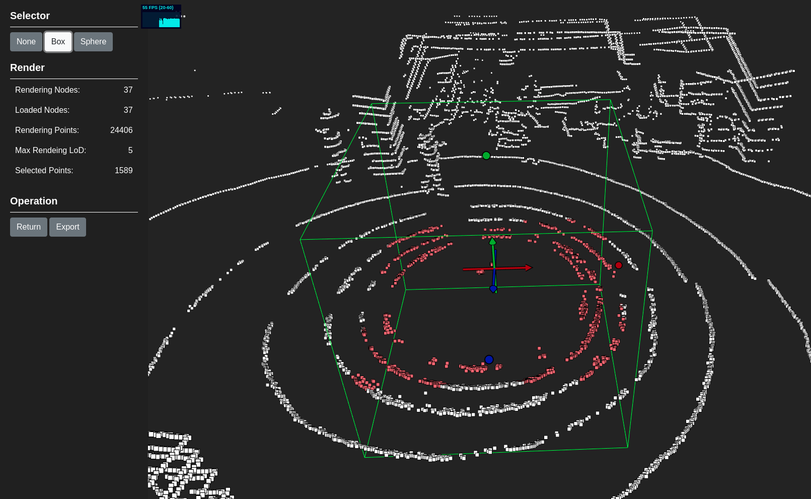

# PCEditor

PCEditor aims for displaying and editting massive point cloud data.



## Introduction

PCEditor is based on MNO tree structure which processes the orgin point cloud data into indexed tree structure.
With out-core algorithms, PCEditor can display massive point cloud data in different LoD and enable users to edit them interactively.  

PCEditor is built by Electron & Typescript & Threejs.
For now, PCEditor provides with some basic features but still needs a long way to go.

## Usage

Though PCEditor is far from completion, you can still give a try. 
Simply type these commands in root directory:
```
npm install
npm start
```
Then you can import your `.pcd` file and edit it.

For now, PCEditor supports:
 - Import & Export `.pcd` file
 - Manange point cloud projects
 - Display point cloud data in different LoD
 - Select and delete point cloud with Box selector and Sphere selector

## Todos

 - Support more formats of point cloud data
 - Enable to add & drag points
 - Use cpp module to improve the efficiency of creating mno index
 - Modify the shaders to improve the display effect
 - Select tree structure need to be improved
 - LoD calculation still contains some bugs
 - and MORE Feature, BETTER Efficiency
